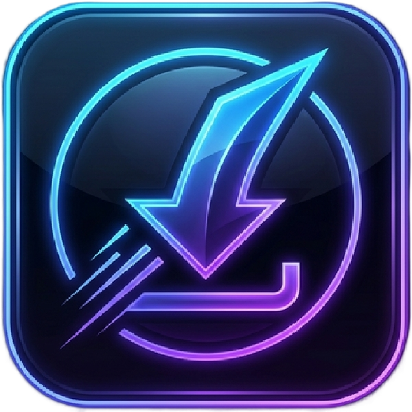

  
  <h1>Sizer Video Downloader ⚡</h1>
  <p><strong>Professional, Fast, and Secure Video Downloader for Desktop</strong></p>
  
  [](https://opensource.org/licenses/ISC)
  [](https://electronjs.org/)
</div>


---

## 🌍 Language Options / Dil Seçenekleri
- [English Documentation](#-english-documentation)
- [Türkçe Dokümantasyon](#-türkçe-dokümantasyon)

---

## 🇬🇧 English Documentation

Sizer Video Downloader is an Electron-based desktop application designed to swiftly analyze and download videos from various platforms (YouTube, Dailymotion, etc.) using `yt-dlp`. It features a sleek, neon-dark UI, clipboard integration, and multiple resolution options.

### ✨ Features
- **Multi-Platform Support**: Powered by `yt-dlp`, supporting hundreds of video sites.
- **Smart Link Analysis**: Automatically scans and retrieves video metadata (title, thumbnails, max resolution).
- **Flexible Quality Options**: Download in 8K, 4K, 1080p all the way to 144p. Includes formats in both MP4 and MKV, plus audio-only formats (MP3, Opus).
- **Clipboard Integration**: Easily paste URLs directly from the clipboard with a dedicated button.
- **Auto URL Formatting**: If a link misses the `https://` prefix, the app intuitively corrects and processes it.
- **Download History**: Access your past downloads easily through the built-in history modal.
- **Bilingual Interface**: Seamlessly switch between English and Turkish inside the App Settings.

### 🚀 Getting Started

#### Prerequisites
- [Node.js](https://nodejs.org/) (v16+)
- `yt-dlp.exe` and `ffmpeg.exe` must be placed in the project root directory alongside `main.js`.

#### Installation
1. Clone the repository:
   ```bash
   git clone https://github.com/your-username/SizerVideoDownloader.git
   cd SizerVideoDownloader
   ```
2. Install the required Node dependencies:
   ```bash
   npm install
   ```
3. Run the application:
   ```bash
   npm start
   ```

#### Building the Executable
To package the app for Windows (x64), use:
```bash
npm run build
```

---

## 🇹🇷 Türkçe Dokümantasyon

Sizer Video Downloader, masaüstünden çeşitli platformlardaki (YouTube, Dailymotion vb.) videoları hızlı ve güvenli bir şekilde indirmek için tasarlanmış Electron tabanlı bir uygulamadır. Arka planda `yt-dlp` gücünü kullanarak şık, neon karanlık bir kullanıcı arayüzü sunar.

### ✨ Özellikler
- **Çoklu Platform Desteği**: `yt-dlp` altyapısı sayesinde yüzlerce siteden video indirebilme.
- **Akıllı Bağlantı Analizi**: Linki yapıştırdığınızda videonun adını, resmini ve çözünürlüğünü anında analiz eder.
- **Esnek Kalite Seçenekleri**: 8K, 4K, 1080p, 720p dahil olmak üzere MP4 veya MKV formatında medya indirebilme. Ayrıca sadece ses de çekebilirsiniz (OPUS, MP3).
- **Pano Entegrasyonu**: Kopyaladığınız bağlantıyı arayüzdeki "Panodan Yapıştır" düğmesiyle tek tıkla arama kutusuna taşıyabilirsiniz. 
- **Otomatik Link Formatlama**: URL'i kopyalarken `https://` ön ekini almamış olsanız bile sistem otomatik olarak formata uygun hale getirir.
- **İndirme Geçmişi**: Daha önce indirdiğiniz dosyalara ve konumlarına geçmiş kayıtlarından hızlıca göz atıp erişebilirsiniz.
- **Çift Dil Arayüzü**: Ayarlar üzerinden İngilizce ve Türkçe arasında kolayca geçiş yapabilirsiniz.

### 🚀 Başlangıç

#### Gereksinimler
- [Node.js](https://nodejs.org/) (v16+)
- `yt-dlp.exe` ve `ffmpeg.exe` dosyalarının, `main.js` dosyasıyla aynı ana (root) klasör dizininde bulunduğundan emin olun.

#### Kurulum
1. Repoyu klonlayın:
   ```bash
   git clone https://github.com/your-username/SizerVideoDownloader.git
   cd SizerVideoDownloader
   ```
2. Gerekli kütüphaneleri yükleyin:
   ```bash
   npm install
   ```
3. Uygulamayı çalıştırın:
   ```bash
   npm start
   ```

#### Uygulamayı Derleme (Build)
Uygulamayı Windows (x64) ortamı için .exe haline getirmek isterseniz aşağıdaki komutu kullanabilirsiniz:
```bash
npm run build
```

---

### 📝 License / Lisans
This project is licensed under the [ISC License](https://opensource.org/licenses/ISC).
